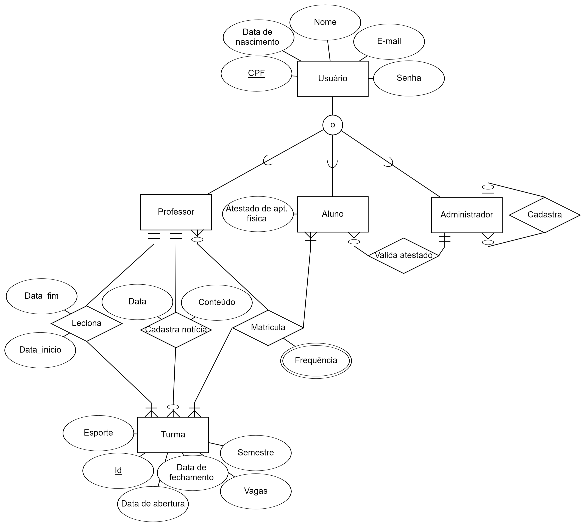

# Gerenciador_matriculas_esporte

O projeto trata de uma atividade proposta pelas disciplinas integradas de **Projeto e Engenharia de Software** e **Banco de Dados** do semestre 2023.2 da UFRN, na qual deve-se desenvolver uma aplicação web (front-end e back-end) para lidar com algum problema.

Especificamente no nosso caso, o **gerenciador de matrículas em esportes** é voltado para a matrícula em esportes presentes na UFRN. Hoje, é preciso que as pessoas vão em um determinado dia no ginásio da universidade, semestralmente, para tentar se matricular em alguma modalidade de forma presencial, às cegas, sem nem saber se há vagas disponíveis. Este projeto busca o desenvolvimento de um aplicativo para que essa operação se torne totalmente remota e com toda a comodidade possível a seus usuários, e também estender suas funcionalidades através de informações a quem deseja praticar o esporte e precisa gerenciar o sistema.

## Pontos importantes
O sistema tem 03 atores  Aluno , Professor e Administrador, tendo como requisitos mais importantes da aplicação:

- Aluno se matricular ;
- Aluno conseguir listar as turmas;
- Professor criar turma ;
- Administrador cadastrar novos Administradores ;
- Professor cadastrar notícia.

## Modelo Entidade Relacionamento (ER)
Abaixo temos o modelo ER , que demonstra como as entidades do sistema se relacionam :



## Modelo relacional
O modelo relacional para o gerenciador de matrículas em esportes está fundamentado no banco de dados específico desenvolvido para essa aplicação, conforme detalhado abaixo:

[Modelo Relacional](https://dbdiagram.io/d/Trabalho-banco-de-dados-655796eb3be14957873787ed)

## Consultas ao banco de dados
O Django provê uma forma nativa de trabalhar com banco de dados relacional SQLite, por meio de Models e Views. Sendo assim, nossos ``SELECT``, ``JOINs`` e ``WHERE`` foram traduzinos para essa forma nativa mecionada.

Entre as consultas, a mais desafiadora foi a seguir:

```
leciona_ativos = Leciona.objects.filter(
  Q(prof_cpf__user_cpf__cpf=self.prof_cpf_logado) & 
  Q(turma_id__id=turma_id) &
  Q(turma_id__is_open=True)
).first()

if leciona_ativos:
  noticias = Noticia.objects.filter(
      Q(turma_id=leciona_ativos.turma_id) & 
      Q(prof_cpf=leciona_ativos.prof_cpf)
    ).order_by('-data_publicacao')
```

Na qual o professor que está logado requisita as notícias cadastra em uma determinada turma. Na tabela Leciona, que mantém o histórico das turmas que os professores dão ou deram aula, é capturada a tupla que na qual o professor referenciado pela chave extrangeira possui o CPF igual ao do professor que está logado, tem o id da turma igual a da turma que o professor quer verificar as notícias e a turma em questão está aberta (só é possível verificar notícias de turmas abertas). Como só existe uma instância que atende esses requisitos, uma vez que um professor só pode dar aula em uma determinada turma com id "n" uma vez, é possível ter tercesa que o professor está tentando verificar as notícias de turmas que ele é cadastrado como discente. Assim, caso tenha sido devolvida uma instância nessa consulta, é possível capturar as notícias que possuem o id da turma requisitada pelo professor e que o CPF do professor que cadastrou a notícia é igual àquele que ao do professor que fez a requisição. Essas notícias são ordenadas em ordem descrescente de data de publicação e devolvidas para o usuário.
